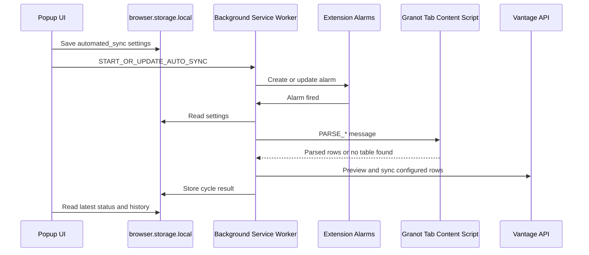

# Granot Sync Background Auto-Sync Option

## Purpose

This document describes how to move automatic Granot sync out of the popup and into the extension background service worker so configured jobs can continue after the popup closes.

The design covers:

- `automated_sync` settings.
- Extension alarm scheduling.
- Target Granot tab selection.
- Graceful wrong-page handling.
- Form lead and call lead workflow behavior.
- Safety rules for unattended sync.

## Current Limitation

Today, auto sync runs inside `src/entrypoints/popup/main.ts` with `window.setInterval()`.

That means:

- Auto sync starts only after the popup UI is opened.
- The timer lives only as long as the popup or detached popup window stays open.
- Closing the popup destroys the timer.
- Auto-running state is not durable background state.
- Call lead auto-sync currently runs enrichment only and does not run booked reconciliation.

The current background entrypoint, `src/entrypoints/background.ts`, only logs startup/install events and receives a placeholder `GRANOT_PAGE_DATA` message. It is not yet a sync runner.

## Target Behavior

The owner should be able to enable background automation from the extension sidebar:

```json
{
  "automated_sync": {
    "enabled": true,
    "interval_minutes": 5,
    "target_tab_id": 123,
    "workflows": {
      "form_leads": true,
      "call_lead_enrichment": true,
      "booked_call_reconciliation": false
    }
  }
}
```

When enabled, the extension should:

1. Store settings in extension storage.
2. Create or update an extension alarm.
3. On each alarm, find the selected Granot tab.
4. Send parser messages to the content script in that tab.
5. Preview and sync configured workflows.
6. Store a cycle result for the popup to display later.

The popup becomes the control panel and status viewer. The background service worker becomes the scheduler and runner.

## Runtime Architecture



## Important Constraint

The background worker cannot read the Granot DOM directly.

It still needs an open Granot tab with the content script injected. The realistic behavior is:

> Run automatically when enabled and when a configured Granot CRM tab is open.

It is not:

> Run with no browser tab or CRM page available.

A separate `new Worker()` does not solve this because DOM parsing still has to happen in a content script attached to the Granot page. The browser extension service worker plus alarms is the right worker model for this use case.

## Settings Shape

Create a typed settings module, for example `src/auto-sync/settings.ts`:

```ts
type AutomatedSyncSettings = {
  enabled: boolean;
  intervalMinutes: number;
  targetTabId?: number;
  targetWindowId?: number;
  workflows: {
    formLeads: boolean;
    callLeadEnrichment: boolean;
    bookedCallReconciliation: boolean;
  };
  safety: {
    previewOnly?: boolean;
    allowFallbackFormMatches?: boolean;
  };
};
```

Use `browser.storage.local` for the first version. Local storage is appropriate because the setting depends on an open local browser tab.

Recommended storage keys:

- `granot-sync:auto-sync-settings-v1`
- `granot-sync:auto-sync-cycles-v1`
- `granot-sync:auto-sync-last-status-v1`

## Target Tab Behavior

The safest first version should require the owner to choose a target tab:

- Add a `Use this Granot tab for background sync` action.
- Store `tabId`, `windowId`, tab URL, and selected time.
- On each cycle, verify that the tab still exists and its URL matches `GRANOT_URL_PATTERNS`.
- If the tab is closed or navigated away, store a skipped cycle and show a clear popup warning.

Fallback options can come later:

- Use the first open tab matching `GRANOT_URL_PATTERNS`.
- Store separate target tabs per workflow.
- Ask the owner to reselect a tab when the old target disappears.

## Graceful Wrong-Page Handling

The owner may be on a page that does not contain the expected table. That should not disable automation.

On each cycle:

- For form leads, send `PARSE_FOLLOW_UP_ROWS`.
- For call lead enrichment and booked reconciliation, send `PARSE_CALL_LEAD_TABLES`.
- If the content script responds but no matching table is found, record a skipped cycle.
- Include page URL, page title if available, workflow, and parser message in the cycle details.
- Continue future cycles.

Examples:

- Form automation enabled but owner is on a Call Leads page: skipped, no form table found.
- Call automation enabled but owner is on a form edit page: skipped, no call lead tables found.
- Content script does not respond: failed cycle with reload guidance.

## Workflow Behavior

### Form Leads

The background runner should eventually reuse extracted form lead workflow functions:

1. Parse `Booked Jobs` and `Follow Up Estimates`.
2. Preview rows against Vantage.
3. Sync safe rows.
4. Store row-level results.

Once fallback matching exists, automated sync should only sync fallback matches when the preview result is unambiguous and allowed by settings.

### Call Lead Enrichment

This is the existing call lead auto-sync behavior:

1. Parse call lead tables.
2. Preview enrichment rows from `Follow Up Estimates`.
3. Sync updateable enrichment rows.

Keep this as a separate workflow flag.

### Booked Call Reconciliation

Booked call reconciliation should be optional and explicit:

1. Parse call lead tables.
2. Preview booked reconciliation rows from `Booked Jobs`.
3. Sync updateable booked reconciliation rows only when the owner enabled this workflow.

Do not silently include this under normal call lead enrichment automation.

## Cycle Result Shape

Store enough detail for the popup to show what happened while it was closed:

```ts
type AutoSyncCycle = {
  id: string;
  startedAt: string;
  finishedAt: string;
  status: "ok" | "skipped" | "failed";
  workflow:
    | "form-leads"
    | "call-lead-enrichment"
    | "booked-call-reconciliation";
  targetTabId?: number;
  targetUrl?: string;
  message: string;
  counts: {
    scanned: number;
    updateable: number;
    updated: number;
    unchanged: number;
    failed: number;
    skipped: number;
  };
  details: Array<{
    rowId?: string;
    label?: string;
    status: "ok" | "unchanged" | "skipped" | "failed";
    message: string;
  }>;
};
```

Keep only the most recent cycles, for example 25 per workflow.

## Required Architecture Change

Before implementing background sync, extract reusable workflow logic from `popup/main.ts`.

The background worker should not import popup DOM/render modules. It should import pure workflow modules and API clients.

Recommended target modules:

- `src/workflows/form-leads/scan.ts`
- `src/workflows/form-leads/preview.ts`
- `src/workflows/form-leads/sync.ts`
- `src/workflows/call-leads/preview.ts`
- `src/workflows/call-leads/sync.ts`
- `src/auto-sync/settings.ts`
- `src/auto-sync/cycles.ts`
- `src/auto-sync/background-runner.ts`
- `src/messaging/tabs.ts`

The popup can continue to render state and call these workflows manually.

## Extension Permissions

Add `alarms` to `wxt.config.ts`.

Existing tab/content-script permissions should be reviewed to ensure the background service worker can:

- Query tabs.
- Send messages to the selected tab.
- Access frame-aware content script responses where needed.
- Read/write extension storage.

## Recommended Implementation Order

1. Extract pure helper and workflow code out of `popup/main.ts`.
2. Add tests for parser behavior and workflow payload mapping.
3. Add a typed automated sync settings module.
4. Add UI controls for enabling/disabling background automation.
5. Persist settings in `browser.storage.local`.
6. Add the `alarms` permission.
7. Implement `background.ts` scheduling and cycle execution.
8. Store cycle results in storage.
9. Update popup UI to show background state and recent cycles.
10. Enable form leads first, then call enrichment, then optional booked reconciliation.

## Safety Notes

- Add a visible `background auto sync enabled` indicator in the popup.
- Record last run time, target tab, status, updated count, unchanged count, failed count, and skipped count.
- Support `previewOnly` before unattended PATCH requests if the owner wants a dry-run phase.
- Never sync ambiguous fallback form-lead matches.
- Treat missing tables as skipped cycles, not fatal configuration errors.
- Prevent overlapping cycles with a background lock.
- Limit cycle history size in storage.
- Treat `VITE_VANTAGE_API_SECRET` carefully because it is bundled into the extension build.

