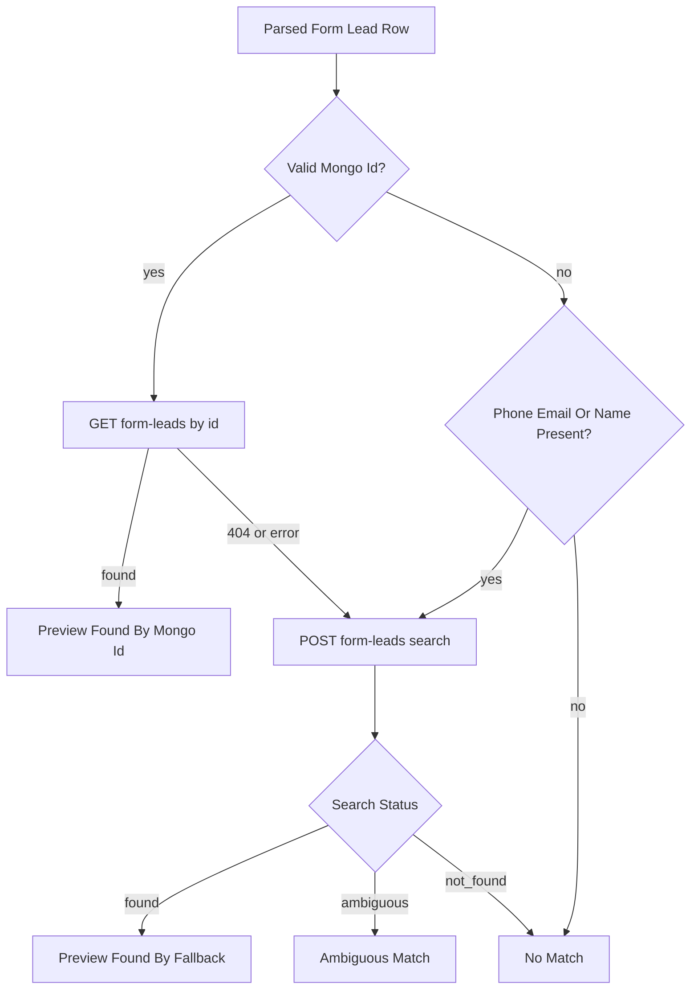

# Granot Sync Search And Fallback Design

## Purpose

This document describes the technical design for:

- A Vantage search workspace inside the Granot Sync extension.
- Fallback form lead matching when Granot `ref_no` does not resolve to a Vantage Mongo id.
- Booking visibility for form and call leads.
- Server additions that would make these flows safer and faster.

## Current State

### Extension

The popup currently has workflows for form leads, a single form edit lead, call lead enrichment, and booked call lead reconciliation.

Form lead table sync currently does this:

```text
Granot ref_no column -> validate as Mongo ObjectId -> GET /api/v1/form-leads/:id -> PATCH /api/v1/form-leads/:id
```

Rows with invalid `ref_no` values are marked `invalid_ref_no` by the content script and do not enter preview or sync.

Call leads already use a stronger server-backed pattern:

```text
Granot table rows -> POST preview endpoint -> receive match_method/status/has_booking -> POST sync endpoint
```

That call-lead pattern should guide the form-lead redesign.

### Server

Useful routes already exist:

- `GET /api/v1/form-leads/:id`
- `POST /api/v1/form-leads/search`
- `POST /api/v1/call-leads/search`
- `POST /api/v1/call-leads/enrichment/preview`
- `POST /api/v1/call-leads/enrichment/sync`
- `POST /api/v1/call-leads/booked-reconciliation/preview`
- `POST /api/v1/call-leads/booked-reconciliation/sync`
- `GET /api/v1/booked-leads`
- `GET /api/v1/cancelled-leads`
- `GET /api/v1/customers`

Gaps:

- The extension does not call form/call search routes.
- Form lead preview is N+1 `GET` requests instead of one batch endpoint.
- Bookings, cancellations, and customers only have list endpoints, not search endpoints.
- Form lead lookup returns only `_id`, `ref_no`, `quoted`, `cubic_feet`, and `booked`.
- The server search field `ref_no` is the `FormLead.ref_no` business field, while Granot table `ref_no` currently stores a Mongo id.

## Search Workspace

Add a new popup workspace, likely `search`, with entity tabs:

- `Form Leads`
- `Call Leads`
- `Bookings`
- `Cancellations`
- `Customers`

The first version can call existing APIs:

| Entity | First API | Notes |
| --- | --- | --- |
| Form leads | `POST /api/v1/form-leads/search` | Search by name, email, phone, and business `ref_no`. |
| Call leads | `POST /api/v1/call-leads/search` | Search by phone, job number, email, and name. |
| Bookings | `GET /api/v1/booked-leads` | Initially list latest 200 and filter client-side. |
| Cancellations | `GET /api/v1/cancelled-leads` | Initially list latest 200 and filter client-side. |
| Customers | `GET /api/v1/customers` | Initially list latest 200 and filter client-side. |

Recommended server-backed search routes for later:

- `POST /api/v1/booked-leads/search`
- `POST /api/v1/cancelled-leads/search`
- `POST /api/v1/customers/search`

### Search State

The extension should keep search state independent from sync state:

```ts
type SearchEntity =
  | "form-leads"
  | "call-leads"
  | "bookings"
  | "cancellations"
  | "customers";

type SearchState = {
  entity: SearchEntity;
  query: {
    source_company?: string;
    phone_number?: string;
    email?: string;
    name?: string;
    job_no?: string;
    ref_no?: string;
  };
  loading: boolean;
  error?: string;
  results: SearchResult[];
};
```

Use one search form and show/hide fields by entity. Keep the first version simple and avoid advanced query builders.

## Form Lead Fallback Matching

### Problem

Granot form lead rows already include useful values:

- `refNo`
- `customer`
- `phone`
- `email`
- `prior`
- `estCf`
- `source`

Only `refNo` is used for lookup today. This fails when the Granot value is not a valid current Mongo id.

### Short-Term Extension Fallback

This can ship before a new server batch endpoint:



Extension behavior:

1. Try `GET /api/v1/form-leads/:id` when `refNo` is a valid ObjectId.
2. If the id is invalid or the lookup returns not found, call `POST /api/v1/form-leads/search`.
3. Search with `{ phone_number: row.phone, email: row.email, name: row.customer }`.
4. If `status === "found"`, store the resolved lead `_id` on the preview.
5. If `status === "ambiguous"`, show candidates and do not select the row for automatic sync.
6. If `status === "not_found"`, show a not-found preview.

The row should keep both ids:

```ts
type ResolvedFormLeadPreview = {
  granotRefNo: string;
  resolvedFormLeadId?: string;
  matchMethod:
    | "mongo_id"
    | "phone"
    | "email"
    | "name"
    | "phone_and_email"
    | "composite"
    | "none";
};
```

### Safer Long-Term Batch Endpoint

The durable design is a server endpoint modeled after call lead enrichment:

- `POST /api/v1/form-leads/enrichment/preview`
- `POST /api/v1/form-leads/enrichment/sync`

Request:

```ts
type FormLeadEnrichmentRowPayload = {
  row_id: string;
  row_index?: number;
  mongo_id?: string;
  customer?: string;
  phone?: string;
  email?: string;
  source?: string;
  prior?: string;
  est_cf?: string;
};
```

Response:

```ts
type FormLeadEnrichmentResult = {
  row_id: string;
  status:
    | "updateable"
    | "updated"
    | "unchanged"
    | "has_booking"
    | "ambiguous"
    | "no_match"
    | "invalid"
    | "conflict"
    | "failed";
  message: string;
  form_lead_id?: string;
  match_method?:
    | "mongo_id"
    | "phone"
    | "email"
    | "name"
    | "phone_and_email"
    | "composite"
    | "none";
  has_booking?: boolean;
  booking_id?: string;
  changes: string[];
  warnings: string[];
  parsed?: Record<string, unknown>;
};
```

Server resolution order:

1. If `mongo_id` is valid, attempt `FormLead.findById(mongo_id)`.
2. If not found, search by phone/email/name.
3. If `source` is available and maps cleanly to `source_company`, optionally use it to break ties.
4. If one confident lead is found, compute `quoted` and `cubic_feet` changes.
5. If multiple equivalent matches are found, return `ambiguous`.
6. Return booking attachment from `lead.booked`.

Sync should patch only rows returned as safe/updateable by preview. Ambiguous rows should remain manual review only.

## Preview States

Recommended form lead preview states:

| State | Meaning | Sync allowed |
| --- | --- | --- |
| `found_by_mongo_id` | Granot `ref_no` resolved directly to a Vantage lead. | Yes |
| `found_by_fallback` | Mongo id failed or was invalid, but phone/email/name found one lead. | Yes, if confidence is high or medium with clear match fields |
| `has_booking` | Matched lead has `booked` set. | Yes for lead fields, booking link preserved |
| `idempotent` | Vantage already matches Granot values. | Yes, but no material change |
| `will_update` | `quoted` or `cubic_feet` differs. | Yes |
| `ambiguous_match` | Multiple leads matched with equal confidence. | No |
| `not_found` | No id or fallback match. | No |
| `preview_error` | API or validation failure. | No |

The current UI can keep `has_booking`, `idempotent`, `will_update`, `not_found`, and `preview_error`, but it should add match method metadata so the message can distinguish direct id matches from fallback matches.

## Messaging Examples

- `Found by Mongo id. No booking attached. Sync will change quoted and cubic_feet.`
- `No form lead was found with Granot ref_no 665..., but Vantage found one by phone and email.`
- `Found by fallback search. Booking attached: 667... . Sync will refresh cubic_feet on the form lead and preserve the booking link.`
- `Ambiguous fallback match: 2 form leads matched this phone number. Add email or review in Vantage before syncing.`
- `No Vantage form lead matched the Mongo id, phone, email, or customer name from this row.`

## Booking Visibility

For the first implementation, booking visibility should come from:

- `FormLead.booked` on form lead lookup/search results.
- `has_booking` and `booking_id` on call lead enrichment/reconciliation results.

UI changes:

- Add a consistent `booking attached` chip to lead result rows.
- Display booking id when available.
- Count Vantage booking attachments separately from Granot `Booked Jobs` table rows.
- Include booking status in automated sync cycle details.

Later server enrichment can return:

```ts
type BookingSummary = {
  _id: string;
  job_no?: string;
  booked_date?: string;
  cancelled?: string | null;
};
```

## Table Parsing Hardening

Parser changes should happen after characterization tests are added:

- Extract parser logic from `granot-crm.content.ts` into pure modules under `src/parsers/granot`.
- Expand header aliases for variants like `Ref No`, `Ref #`, `Priority`, and `Estimated CF`.
- Normalize headers by lowercasing and stripping punctuation/extra whitespace.
- Score candidate tables by useful columns when section heading detection fails.
- Treat invalid `ref_no` rows as fallback-eligible when phone, email, or customer exists.

Do not silently sync parser-recovered rows until preview confirms one unambiguous Vantage lead.

## Implementation Sequence

1. Add extension API wrappers for existing form/call search endpoints.
2. Add search workspace state and UI.
3. Add fallback preview for form rows, but keep sync disabled for fallback matches initially if desired.
4. Store `resolvedFormLeadId` separately from `row.refNo`.
5. Enable safe fallback sync for unambiguous matches.
6. Add server batch form-lead enrichment endpoints.
7. Move extension form-lead preview/sync to the batch endpoints.
8. Add booking/cancellation/customer search endpoints when client-side filtering is insufficient.

## Safety Rules

- Never PATCH a fallback match when the server reports ambiguity.
- Never use the Granot `ref_no` string as the PATCH id after a fallback match; use the resolved Vantage lead `_id`.
- Preserve the existing booking link when updating `quoted` or `cubic_feet`.
- Show match method in the row before sync.
- Log fallback matching in cycle history so automated sync is auditable.

