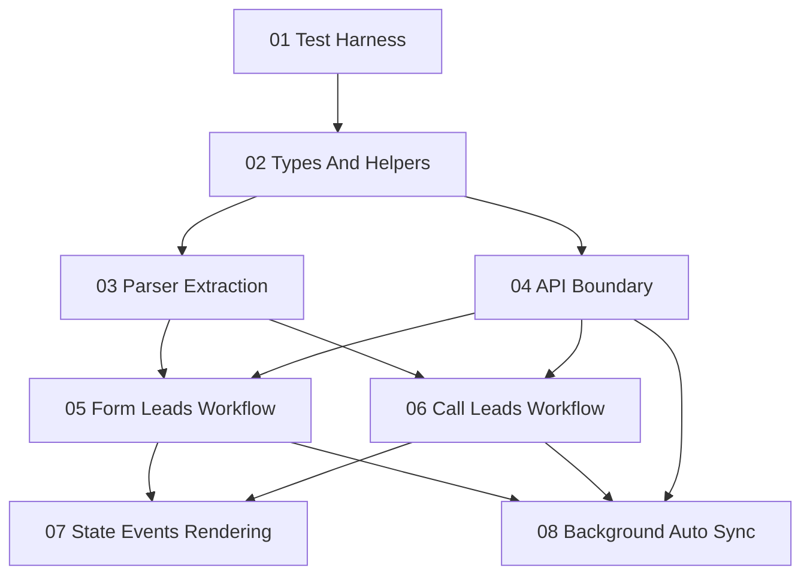

# Granot Sync Refactor Plans

## Purpose

This directory breaks the Granot Sync extension refactor into ordered units of work. The goal is to make the current code easier to test, reason about, and extend before adding the search workspace, fallback form matching, booking visibility improvements, and background automated sync.

The refactor should preserve current owner behavior while reducing the risk of future feature work.

## Current Refactor Target

The main code pressure is:

- `src/entrypoints/popup/main.ts` combines state, DOM lookup, rendering, event wiring, tab messaging, preview, sync, cycle history, and popup-only auto-sync.
- `src/entrypoints/granot-crm.content.ts` combines content-script message handling with parsing for form rows, form edit lead pages, and call lead tables.
- `src/utils/api.ts` mixes transport and all endpoint wrappers.
- Background automation cannot reuse popup sync logic safely while workflow code depends on popup DOM rendering.

## Unit Order

Run the units in this order:

1. [`01_test_harness_and_characterization.md`](01_test_harness_and_characterization.md)
2. [`02_extract_shared_types_and_pure_helpers.md`](02_extract_shared_types_and_pure_helpers.md)
3. [`03_extract_granot_parsers.md`](03_extract_granot_parsers.md)
4. [`04_extract_api_boundary.md`](04_extract_api_boundary.md)
5. [`05_extract_form_leads_workflow.md`](05_extract_form_leads_workflow.md)
6. [`06_extract_call_leads_workflow.md`](06_extract_call_leads_workflow.md)
7. [`07_split_state_events_and_rendering.md`](07_split_state_events_and_rendering.md)
8. [`08_prepare_background_auto_sync.md`](08_prepare_background_auto_sync.md)

## Dependency Map



## Refactor Rules

- Preserve existing manual workflows after every unit.
- Keep each unit small enough to compile and review on its own.
- Prefer moving code before changing behavior.
- Add behavior changes only after relevant code is extracted and tested.
- Do not introduce the new feature set during these units unless a unit explicitly says it is a preparatory API or type surface.
- Keep compatibility re-exports during module splits so imports can migrate gradually.
- Use real Granot HTML fixtures for parser changes.

## Global Acceptance Gates

Each unit should pass:

```bash
pnpm compile
```

When the test harness exists, each unit should also pass:

```bash
pnpm test
```

Manual smoke checks should cover:

- Form Leads scan and preview from `Booked Jobs` and `Follow Up Estimates`.
- Form Leads sync for supported rows.
- Form Edit Lead scan and sync.
- Call Leads scan and enrichment preview.
- Call Leads enrichment sync.
- Booked call lead reconciliation preview and sync.
- Diagnose Page still reports frame/content-script status.

## End State

After these units, `popup/main.ts` should be a thin coordinator:

- initialize DOM refs
- load state
- wire high-level events
- route workspace rendering
- call extracted workflow services

Feature implementation should then be able to add:

- Search workspace.
- Form lead fallback matching.
- Stronger table parsing.
- Booking/cancellation chips.
- Background automated sync.

without adding more business logic to the popup monolith.

